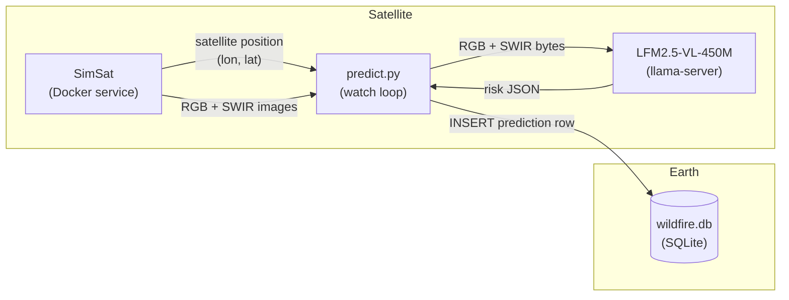
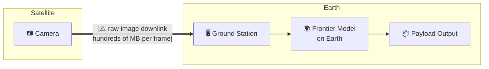
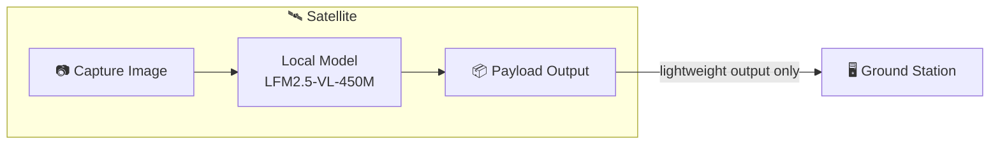
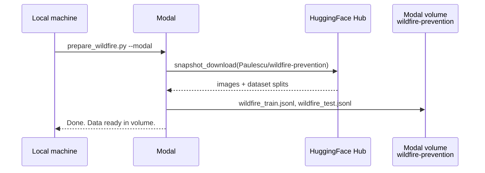
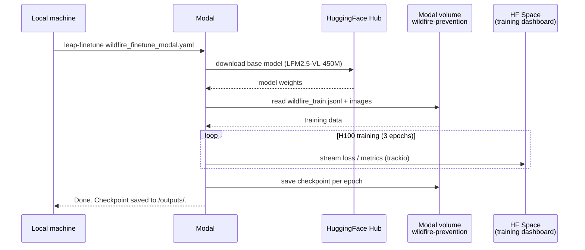

<Card title="View Source Code" icon="github" href="https://github.com/Liquid4All/cookbook/tree/main/examples/wildfire-prevention">
  Browse the complete example on GitHub
</Card>

In this example you will learn how to build a basic wildfire prevention system using:

- Sentinel-2 satellite images
- [LFM2.5-VL-450M](https://huggingface.co/LiquidAI/LFM2.5-VL-450M), a compact Vision-Language Model running directly on the satellite, so inference happens in orbit and only a lightweight JSON payload is downlinked to Earth.



We will cover all the stages of the journey:

## Steps

- [Problem framing](#1-problem-framing)
- [System design](#2-system-design)
- [Data collection and labeling](#3-data-collection-and-labeling-pipeline)
- [Evaluation](#4-evaluation)
- [Fine-tuning](#5-fine-tuning)

## 1. Problem framing

We want to reduce the number of wildfires by identifying areas with high risk from Sentinel-2 images, and providing actionable feedback to local authorities like firefighters so they can act before the fire has even started.


<Note>
  **What is Sentinel-2?**

  Sentinel-2 is a European Space Agency (ESA) satellite mission that captures high-resolution optical imagery of Earth's surface. It's part of the EU's Copernicus programme.

  It consists of 3 satellites (Sentinel-2A, 2B and 2C) which orbit in tandem, revisiting the same location every 5 days at the equator (more frequently at higher latitudes), and capturing **multispectral** images across **13 discrete wavelength ranges** simultaneously. Each range is called a band, and each band carries information about vegetation health, water content, soil moisture, or atmospheric conditions that is not visible to the naked eye.
</Note>

In this repository we use two different images for a given location:

- **RGB (B4-B3-B2):** natural color. Useful for reading urban texture, terrain shape from shadows, and water bodies.
- **SWIR (B12-B8-B4):** shortwave infrared. Highlights vegetation moisture stress and dryness, the primary fuel indicator.

Using this input, we can extract early signs of vegetation distress or urban risk, and alert local authorities.

### Example

1. A Sentinel-2 satellite flies over *Attica (Greece)* on 2024-08-01 and takes these 2 pictures.

   | RGB | SWIR |
   |-----|------|
   |  |  |
   | *Attica, Greece. 2024-08-01* | *Attica, Greece. 2024-08-01* |

2. This image pair is passed to the Vision-Language Model, which has holistic scene understanding, not just pixel-level statistics, and the model extracts the following risk profile.

   ```json
   {
     "risk_level": "high",
     "dry_vegetation_present": true,
     "urban_interface": true,
     "steep_terrain": true,
     "water_body_present": false,
     "image_quality_limited": false
   }
   ```

3. This payload is downlinked to ground control on Earth. As the image tile has high risk, the system sends an alert to local fire services. These can then take precautionary measures like ground patrol deployment or controlled burns to reduce available fuel.

## 2. System design

### Design rationale

You could point a frontier model (GPT-5, Gemini 2.0 Flash, or Claude 3.6 Sonnet) at satellite images and it would do a good job. So why bother using a smaller one that needs fine-tuning?

The bottleneck is not capability. It is **data transmission**.

A frontier model runs on a server on Earth. To use it, the satellite downlinks raw images to a ground station, the ground station feeds the model, and the model produces the output on Earth. Images are high-dimensional: large matrices of pixel values per band, per frame. Multiply that by the number of captures per orbit, and you have a serious bandwidth problem.



A small model removes that bottleneck entirely. At 450M parameters, LFM2.5-VL-450M is compact enough to run directly on the satellite: the satellite captures the image and runs inference on-board, the local model produces the payload output in orbit, and only the lightweight output is downlinked to the ground station.



### Proof of Concept (PoC)

Rather than building a full satellite stack, we simulate the on-board pipeline locally using three components:

- **[SimSat](https://github.com/DPhi-Space/SimSat):** a local Docker service that simulates a satellite orbit and serves real Sentinel-2 imagery from the AWS Element84 STAC catalog.
- **`predict.py`:** a lightweight Python watch loop that polls SimSat for the current position, fetches the images, and drives the inference pipeline.
- **LFM2.5-VL-450M:** the local model running via `llama-server`, playing the role of the on-board VLM.

The system monitors 22 fixed locations. Each location is a single 5 km tile centered on a known fire-prone coordinate. One prediction is produced per location per satellite pass.

<Accordion title="Click to see the 22 monitored locations">
  | id | Location |
  |----|----------|
  | `angeles_nf_ca` | Angeles National Forest, California |
  | `santa_barbara_ca` | Santa Barbara, California |
  | `napa_valley_ca` | Napa Valley, California |
  | `sierra_nevada_ca` | Sierra Nevada, California |
  | `alentejo_portugal` | Alentejo, Portugal |
  | `attica_greece` | Attica, Greece |
  | `cerrado_brazil` | Cerrado, Brazil |
  | `patagonia_argentina` | Patagonia, Argentina |
  | `black_forest_germany` | Black Forest, Germany |
  | `scottish_highlands` | Scottish Highlands |
  | `borneo_rainforest` | Borneo Rainforest |
  | `tanzania_savanna` | Tanzania Savanna |
  | `outback_nsw_australia` | Outback NSW, Australia |
  | `victorian_alpine_au` | Victorian Alps, Australia |
  | `kalahari_botswana` | Kalahari, Botswana |
  | `zagros_iran` | Zagros Mountains, Iran |
  | `negev_israel` | Negev Desert, Israel |
  | `alpine_switzerland` | Swiss Alps |
  | `amazon_brazil` | Amazon, Brazil |
  | `congo_basin_drc` | Congo Basin, DRC |
  | `lahaina_maui_hi` | Lahaina, Maui, Hawaii |
  | `mati_attica_gr` | Mati, Attica, Greece |
</Accordion>

### Quickstart

1. Clone the SimSat repository:

   ```bash
   git clone https://github.com/DPhi-Space/SimSat.git
   cd SimSat
   ```

2. Start SimSat (keep it running in a separate terminal):

   ```bash
   docker compose up
   ```

3. Open the SimSat dashboard at `http://localhost:8000`, click **Start**, and verify the satellite position is moving.

4. Install Python dependencies:

   ```bash
   uv sync
   ```

5. Start the watch loop:

   ```bash
   # Watch all 22 locations
   uv run scripts/predict.py --backend local --model LiquidAI/LFM2.5-VL-450M-GGUF --quant Q8_0

   # Watch a single location
   uv run scripts/predict.py --backend local --model LiquidAI/LFM2.5-VL-450M-GGUF --quant Q8_0 --location attica_greece
   ```

6. Optionally, backfill historical predictions to seed the database before the live loop:

   ```bash
   # All locations, last 7 days
   uv run scripts/backfill.py --backend local --model LiquidAI/LFM2.5-VL-450M-GGUF --quant Q8_0 --days 7

   # Single location, last 90 days (builds a seasonal dataset)
   uv run scripts/backfill.py --backend local --model LiquidAI/LFM2.5-VL-450M-GGUF --quant Q8_0 --days 90 --location attica_greece
   ```

7. Once the database has predictions, launch the app:

   ```bash
   uv run streamlit run app/app.py
   ```

## 3. Data collection and labeling pipeline

We use `claude-opus-4-6` to label a dataset of satellite image pairs.


The dataset is built from a cross-product of locations, spatial tiles, and temporal tiles, then split into train and test by a temporal cutoff.


To run the data collection and labeling pipeline you will need an Anthropic API key.

```bash
export ANTHROPIC_API_KEY=sk-...

# All 22 locations, push final dataset to Hugging Face
uv run scripts/generate_samples.py \
  --start-date 2024-01-01 --end-date 2025-12-31 \
  --n-temporal-tiles 12 --n-spatial-tiles 4 \
  --test-ratio 0.2 --concurrency 3 \
  --hf-dataset your-username/wildfire-risk

# Only 1 region, Attica, Greece
uv run scripts/generate_samples.py \
    --start-date 2024-01-01 --end-date 2024-12-31 \
    --n-temporal-tiles 12 --n-spatial-tiles 4 \
    --test-ratio 0.2 --concurrency 3 \
    --location attica_greece
```

For each `(location, spatial tile, timestamp)` triple, `generate_samples.py` does the following:

1. Creates a timestamped run directory under `data/` (e.g., `data/20260416_143052/`).
2. Samples `--n-temporal-tiles` timestamps evenly spaced within `[--start-date, --end-date]` using bin-center placement, so timestamps are always in the interior of the window.
3. Builds a centered square grid of `--n-spatial-tiles` tiles around each location center, spaced `--size-km` apart.
4. Fetches the RGB and SWIR images in parallel from SimSat for each `(spatial tile, timestamp)` pair.
5. Saves `rgb.png` and `swir.png` to the tile subfolder.
6. Sends both images to `claude-opus-4-6` for risk annotation, with automatic retry on rate-limit errors.
7. Saves the structured JSON output as `annotation.json`.
8. Assigns the tile to `train/` or `test/` based on a temporal cutoff. This prevents near-duplicate images (Sentinel-2 revisits every 5 days) from appearing on both sides of the split.

The resulting directory structure looks like this:

```
data/20260416_143052/
  train/
    attica_greece/
      s00_t00/
        rgb.png
        swir.png
        annotation.json
      s00_t01/
      s01_t00/
      ...
  test/
    attica_greece/
      s00_t09/
      ...
```

To validate a run:

```bash
uv run scripts/check_samples.py                  # most recent run
uv run scripts/check_samples.py 20260416_143052  # specific run
```

The dataset used in the rest of this guide is [Paulescu/wildfire-prevention](https://huggingface.co/datasets/Paulescu/wildfire-prevention). To reproduce it exactly, run:

```bash
uv run scripts/generate_samples.py \
  --start-date 2024-01-01 --end-date 2025-12-31 \
  --n-temporal-tiles 12 \
  --n-spatial-tiles 4 \
  --test-ratio 0.2 \
  --concurrency 4 \
  --hf-dataset your-hf-username/wildfire-prevention
```

## 4. Evaluation

The evaluation pipeline runs a model against a generated dataset and measures how closely its predictions match the Opus-generated ground truth annotations.

```bash
# Evaluate Claude Opus 4.6 (sanity check)
uv run scripts/evaluate.py \
    --hf-dataset Paulescu/wildfire-prevention \
    --backend anthropic \
    --split test

# Evaluate LFM2.5-VL-450M-GGUF at Q8_0 quantization
uv run scripts/evaluate.py \
  --hf-dataset Paulescu/wildfire-prevention \
  --backend local \
  --model LiquidAI/LFM2.5-VL-450M-GGUF \
  --quant Q8_0 \
  --split test
```

Each run saves three files to `evals/{timestamp}/`:

- `report.md`: human-readable accuracy table
- `results.json`: per-sample records with the model's actual predictions, ground truth, and per-field match results
- `meta.json`: run metadata (model, dataset, backend, split)

Once you have two or more eval runs, launch the comparison app to explore results visually:

```bash
uv run streamlit run app/eval_compare.py
```


### Results

Evaluated on 22 locations ([Paulescu/wildfire-prevention](https://huggingface.co/datasets/Paulescu/wildfire-prevention)), ground truth from `claude-opus-4-6`:

- `claude-opus-4-6` scores 0.99 overall, near-perfect across all fields. The result is not 100% due to non-determinism in token sampling.
- The base LFM2.5-VL-450M scores 0.38 overall: it produces valid JSON reliably but struggles with field accuracy, especially `risk_level` (0.08) and `urban_interface` (0.25). This is expected for a zero-shot compact model on a specialized task. Fine-tuning addresses this gap.

| field | claude-opus-4-6 | LFM2.5-VL-450M Q8\_0 |
|---|---|---|
| valid\_json | 1.00 | 1.00 |
| fields\_present | 1.00 | 1.00 |
| risk\_level | 0.99 | 0.08 |
| dry\_vegetation\_present | 0.99 | 0.48 |
| urban\_interface | 0.98 | 0.25 |
| steep\_terrain | 0.99 | 0.45 |
| water\_body\_present | 0.99 | 0.74 |
| image\_quality\_limited | 1.00 | 0.28 |
| **overall** | **0.99** | **0.38** |
| **avg latency (s)** | **2.91** | **0.72** |

## 5. Fine-tuning

We use [leap-finetune](https://github.com/Liquid4All/leap-finetune) to fine-tune `LFM2.5-VL-450M` on the Opus-labeled dataset via Modal's serverless H100 infrastructure.

### Step 1. Install leap-finetune

Clone [leap-finetune](https://github.com/Liquid4All/leap-finetune) inside the project directory and install its dependencies:

```bash
git clone https://github.com/LiquidAI/leap-finetune.git
cd leap-finetune && uv sync && cd ..
```

Authenticate with Hugging Face and Modal:

```bash
cd leap-finetune
uv run huggingface-cli login   # needed to pull the model and dataset
uv run python -m modal setup   # needed to launch the training job
cd ..
```

### Step 2. Prepare the dataset

Prepare the dataset and push it to a Modal volume:

```bash
uv run scripts/prepare_wildfire.py --dataset Paulescu/wildfire-prevention --modal
```

The `--modal` flag spins up a Modal container, downloads the dataset from HuggingFace, converts it to JSONL, and writes everything to a Modal volume named `wildfire-prevention`. The volume is then used directly by the training job in the next step.



### Step 3. Prepare the configuration file

This YAML file is the only file you need to pass to leap-finetune. You can find plenty of examples for different tasks in the [leap-finetune repository](https://github.com/Liquid4All/leap-finetune/tree/main/job_configs).

```yaml
project_name: "wildfire-prevention"
model_name: "lfm2.5-VL-450M"
training_type: "vlm_sft"

dataset:
  ...

training_config:
  ...

peft_config:
  extends: "DEFAULT_VLM_LORA"
  use_peft: false

benchmarks:
  ...

modal:
  app_name: "wildfire-prevention"
  gpu: "H100:1"
  timeout: 7200
  output_volume: "wildfire-prevention"
  output_dir: "/outputs"
  detach: false
```

Two important observations:

- **Full fine-tuning, not LoRA (`use_peft: false`):** we update both the multimodal projector and the full language model backbone. Satellite imagery is severely underrepresented in standard VLM pretraining data, so the projector needs to genuinely re-learn how to map multispectral patches into meaningful tokens. At 450M parameters, full fine-tuning fits on a single H100 without the memory pressure that motivates LoRA on larger models.
- **Modal section:** the `modal` block tells leap-finetune to run the training job on Modal's serverless GPU platform rather than locally. It specifies the GPU type (`H100:1`), a timeout, and the Modal volume where the prepared dataset lives and where checkpoints are written.

### Step 4. Kick off the fine-tuning

Once the configuration YAML file is ready, fine-tuning is as easy as running:

```bash
cd leap-finetune && uv run leap-finetune ../configs/wildfire_finetune_modal.yaml
```



### Step 5. Retrieve the checkpoint

```bash
uv run modal volume ls wildfire-prevention /outputs/
uv run modal volume get wildfire-prevention /outputs/<run-name> ./outputs
```

### Step 6. Quantize the model to GGUF

Running inference with a VLM requires two GGUF files. The following script produces both from a single command:

```bash
uv run scripts/quantize.py \
    --checkpoint ./outputs/<run-name>/<checkpoint> \
    --output ./outputs/lfm2.5-vl-wildfire-Q8_0.gguf
```

- **`--output`** sets the backbone path: the language model weights, quantized to Q8\_0 by default.
- The mmproj (`mmproj-lfm2.5-vl-wildfire-Q8_0.gguf`) is written automatically to the same directory, with `mmproj-` prepended. It contains the vision tower and multimodal projector weights (always F16).

To use a different quantization level for the backbone, pass `--quant Q4_K_M` (or `Q4_0`, `Q5_K_M`, `Q6_K`, `F16`). The mmproj is always F16 regardless of `--quant`.

### Step 7. (Optional) Push the GGUF pair to HuggingFace

```bash
uv run scripts/push_gguf_to_hf.py \
    --backbone ./outputs/lfm2.5-vl-wildfire-Q8_0.gguf \
    --mmproj ./outputs/mmproj-lfm2.5-vl-wildfire-Q8_0.gguf \
    --repo <your-hf-username>/wildfire-risk-detector
```

### Step 8. Evaluate the fine-tuned model

```bash
# From local artifacts
uv run scripts/evaluate.py \
    --hf-dataset Paulescu/wildfire-prevention \
    --backend local \
    --model ./outputs/lfm2.5-vl-wildfire-Q8_0.gguf \
    --mmproj ./outputs/mmproj-lfm2.5-vl-wildfire-Q8_0.gguf \
    --split test

# From HF
uv run scripts/evaluate.py \
    --hf-dataset Paulescu/wildfire-prevention \
    --backend local \
    --model Paulescu/wildfire-risk-detector \
    --quant Q8_0 \
    --split test
```

### Results

Evaluated on 172 test samples ([Paulescu/wildfire-prevention](https://huggingface.co/datasets/Paulescu/wildfire-prevention)), ground truth from `claude-opus-4-6`. Fine-tuning takes the model from 0.38 to 0.84 overall accuracy, more than doubling performance. The largest gains are on `risk_level` (0.08 → 0.76), `urban_interface` (0.25 → 0.93), and `image_quality_limited` (0.28 → 0.86).

| field | claude-opus-4-6 | LFM2.5-VL-450M Q8\_0 (base) | LFM2.5-VL-450M Q8\_0 (fine-tuned) |
|---|---|---|---|
| valid\_json | 1.00 | 1.00 | 1.00 |
| fields\_present | 1.00 | 1.00 | 1.00 |
| risk\_level | 0.99 | 0.08 | 0.76 |
| dry\_vegetation\_present | 0.99 | 0.48 | 0.83 |
| urban\_interface | 0.98 | 0.25 | 0.93 |
| steep\_terrain | 0.99 | 0.45 | 0.81 |
| water\_body\_present | 0.99 | 0.74 | 0.87 |
| image\_quality\_limited | 1.00 | 0.28 | 0.86 |
| **overall** | **0.99** | **0.38** | **0.84** |
| **avg latency (s)** | **2.91** | **0.72** | **0.59** |

## Need help?

<CardGroup cols={1}>

<Card title="Join our Discord" icon="discord" iconType="brands" href="https://discord.gg/DFU3WQeaYD">
  Connect with the community and ask questions about this example.
</Card>

</CardGroup>
